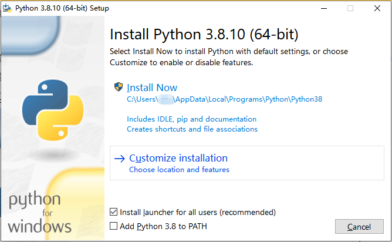
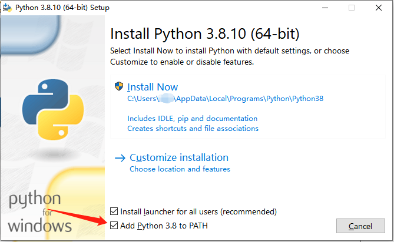
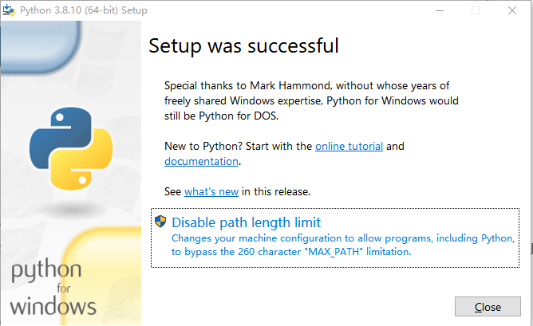
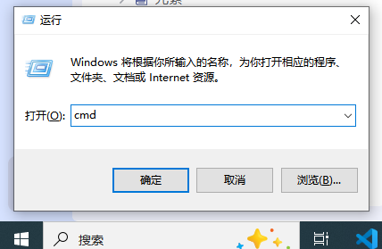
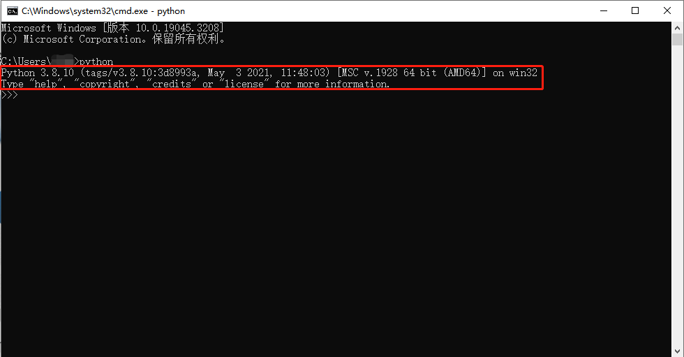
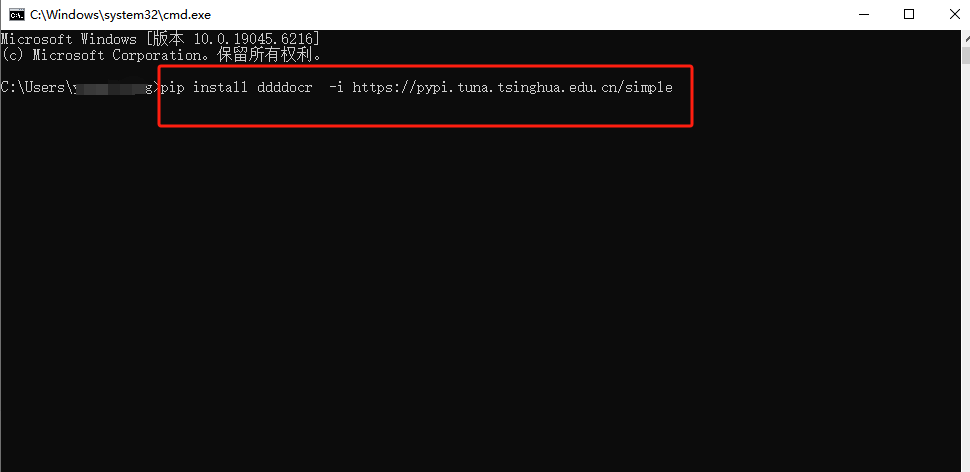
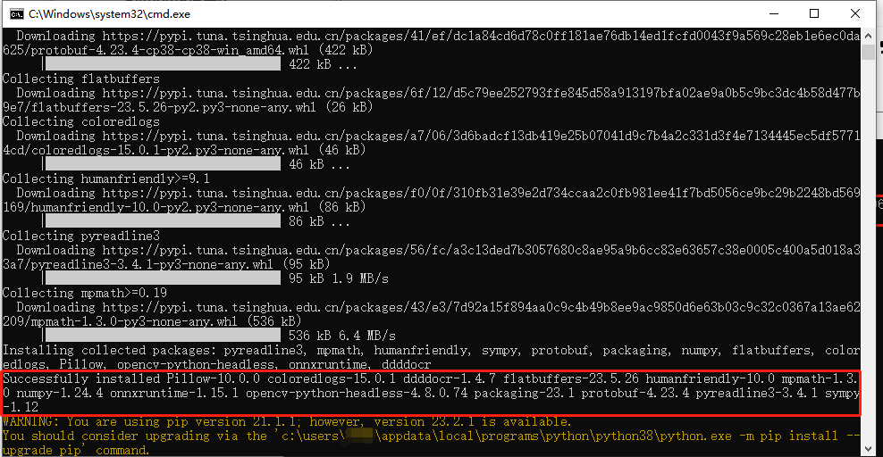
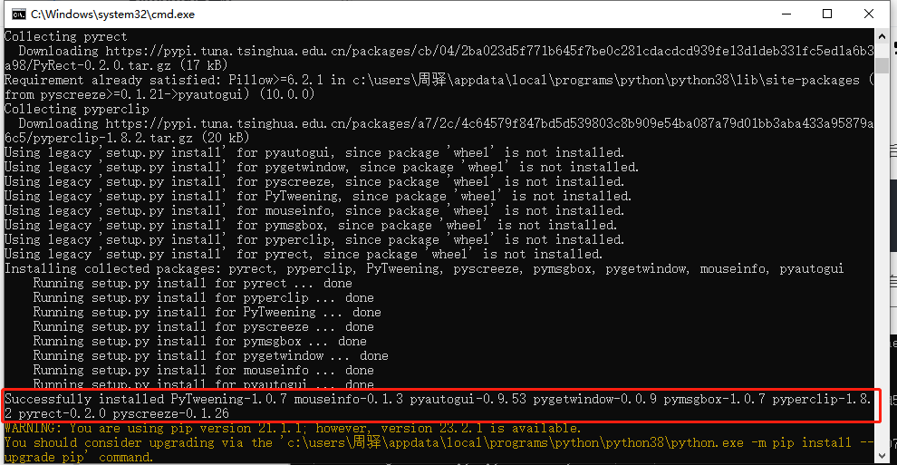

**描述：**在很多场景下，我们会用到RPA的Python指令，以及Python库，下面是Python环境的搭建，以及获取库的教程。

**注意：**

> 在安装八爪鱼RPA软件的过程中，就自动内置了基本的Python环境，同时支持快速安装/卸载/管理Python库；
> 一般情况下使用八爪鱼RPA软件内置的Python环境就能满足需求了，不再需要搭建新的Python环境；
> 内置的Python环境安装Python库的方法请参考：[Python库安装工具；](https://rpa.bazhuayu.com/helpcenter/docs/M07yTZ)

**注意：**如需搭建新的Python环境，请阅读下文。

## Python环境的安装（Windows系统）

以Python 3.8.10版本为例，在 Windows 系统上安装 Python 3.8.10，可以按照以下步骤进行操作：

1.点击下载链接，将Python安装包软件下载到本地；

安装包下载参考url：[https://www.python.org/ftp/python/3.8.10/python-3.8.10-amd64.exe](https://www.python.org/ftp/python/3.8.10/python-3.8.10-amd64.exe)

更对版本，请参考：[https://www.python.org/ftp/python/](https://www.python.org/ftp/python/)

2.打开下载的安装程序（通常为 .exe 文件），运行安装程序。



3. 在安装程序界面中，勾选 "Add Python 3.8 to PATH" 选项，以便在命令行中可以直接使用 python 命令。



4. 点击 "Customize installation" 按钮，可以自定义安装的一些选项，如修改安装路径等。如果不需要特别设置，可以直接点击 "Install Now" 按钮继续安装。

5. 等待安装程序完成安装过程。安装完成后会弹出一个安装成功的提示框。



6. 打开命令提示符（按住键盘 Win键 + R键，输入 "cmd" 并回车），输入 "python" 命令，如果成功显示 Python 版本号，则说明安装成功。

安装成功后再进行后续Python库的安装（如有需要用到Python库的话）。





## Python库的安装：

键盘中按下Win+R，在运行框里输入cmd，然后在命令提示符中输入下方代码，再回车运行，最后静静等待安装完成。

（如案例中对ddddocr、pyautogui 进行python库的安装）



```
pip install ddddocr  -i https://pypi.tuna.tsinghua.edu.cn/simple
pip install pyautogui -i https://pypi.tuna.tsinghua.edu.cn/simple
```

等待安装库组件，安装完成以后弹出安装成功提示，如果有最新版本会提示更新版本，根据需要自行选择。


 



<Info>
  使用过程中遇到问题？前往 [八爪鱼RPA 开发者社区问答板块](https://rpa.bazhuayu.com/community/questions) 提问，获取官方与社区帮助。
</Info>
