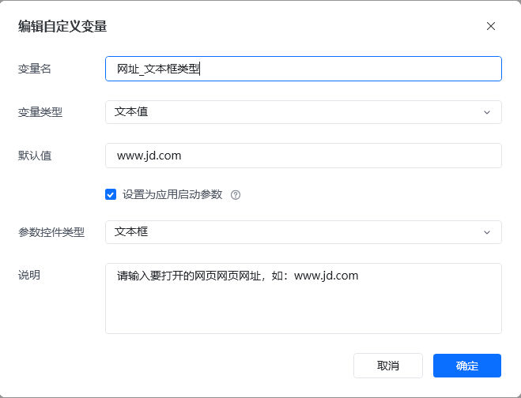
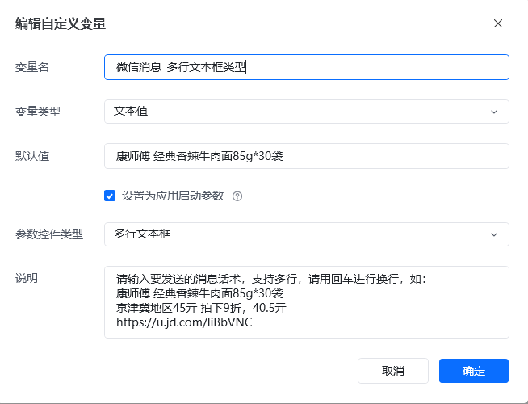
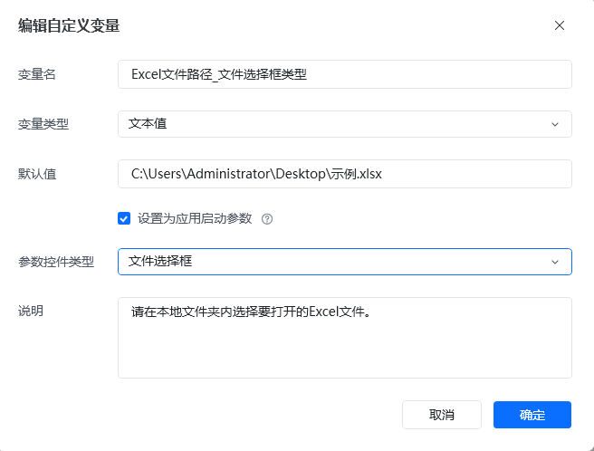
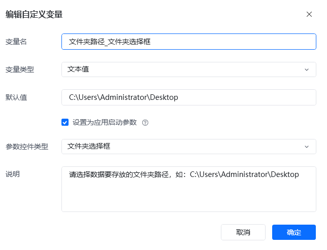
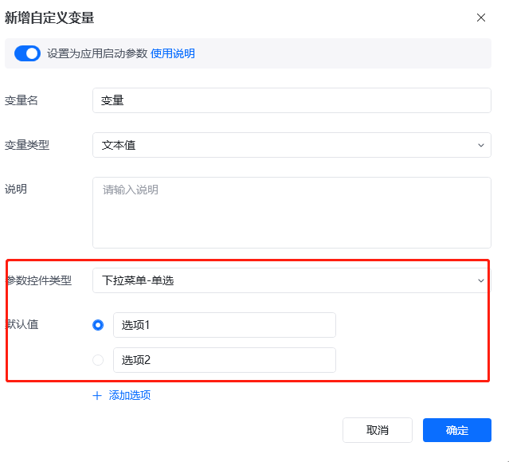
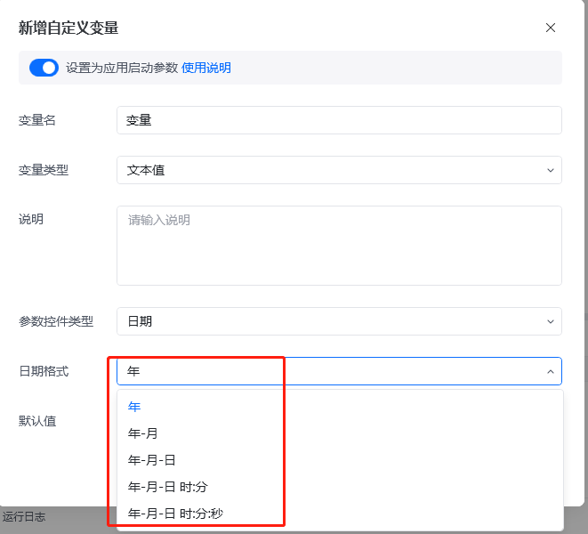
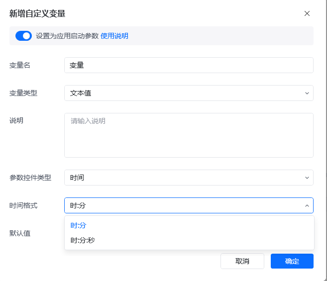
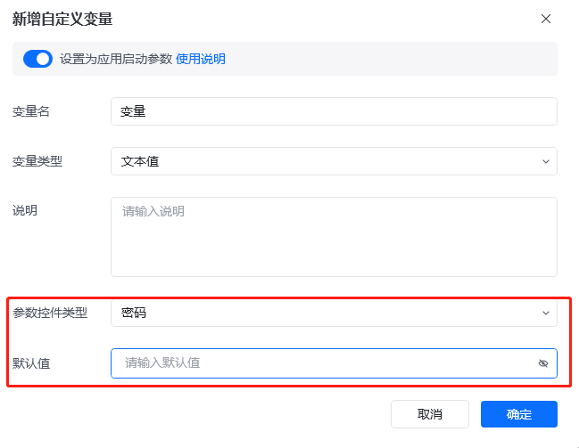

## 1. 新增自定义变量

### 1.1 变量类型（支持设置为启动参数）

①文本值、②数值、③布尔值

### 1.2 启动参数中的文本值参数控件类型

<table style={{width:'100%', borderCollapse:'collapse'}}>
  <thead>
    <tr>
      <th style={{width:'30%', border:'1px solid #e5e7eb', padding:'12px', textAlign:'center'}}>参数控件类型</th>
      <th style={{width:'70%', border:'1px solid #e5e7eb', padding:'12px', textAlign:'center'}}>附图</th>
    </tr>
  </thead>
  <tbody>
    <tr>
      <td style={{border:'1px solid #e5e7eb', padding:'12px', verticalAlign:'middle'}}>
        <strong>文本框</strong> 
        用于单行消息输入到文本框中
      </td>
      <td style={{border:'1px solid #e5e7eb', padding:'12px', verticalAlign:'middle'}}>
        
      </td>
    </tr>
    <tr>
      <td style={{border:'1px solid #e5e7eb', padding:'12px', verticalAlign:'middle'}}>
        <strong>多行文本框</strong> 
        用于多行消息输入到文本框中
      </td>
      <td style={{border:'1px solid #e5e7eb', padding:'12px', verticalAlign:'middle'}}>
        
      </td>
    </tr>
    <tr>
      <td style={{border:'1px solid #e5e7eb', padding:'12px', verticalAlign:'middle'}}>
        <strong>文件选择框</strong> 
        用于选择本地的某个文件
      </td>
      <td style={{border:'1px solid #e5e7eb', padding:'12px', verticalAlign:'middle'}}>
        
      </td>
    </tr>
    <tr>
      <td style={{border:'1px solid #e5e7eb', padding:'12px', verticalAlign:'middle'}}>
        <strong>文件夹选择框</strong> 
        用于选择本地的某个文件夹
      </td>
      <td style={{border:'1px solid #e5e7eb', padding:'12px', verticalAlign:'middle'}}>
        
      </td>
    </tr>
    <tr>
      <td style={{border:'1px solid #e5e7eb', padding:'12px', verticalAlign:'middle'}}>
        <strong>下拉菜单-单选</strong> 
        用于设置下拉框进行选择
      </td>
      <td style={{border:'1px solid #e5e7eb', padding:'12px', verticalAlign:'middle'}}>
        
      </td>
    </tr>
    <tr>
      <td style={{border:'1px solid #e5e7eb', padding:'12px', verticalAlign:'middle'}}>
        <strong>日期</strong> 
        用于日期的选择，避免日期填写不规范
      </td>
      <td style={{border:'1px solid #e5e7eb', padding:'12px', verticalAlign:'middle'}}>
        
      </td>
    </tr>
    <tr>
      <td style={{border:'1px solid #e5e7eb', padding:'12px', verticalAlign:'middle'}}>
        <strong>时间</strong> 
        用于时间的选择，避免时间填写不规范
      </td>
      <td style={{border:'1px solid #e5e7eb', padding:'12px', verticalAlign:'middle'}}>
        
      </td>
    </tr>
    <tr>
      <td style={{border:'1px solid #e5e7eb', padding:'12px', verticalAlign:'middle'}}>
        <strong>密码</strong> 
        用于填写密码，输入时会用黑点覆盖，避免显示具体的密码内容
      </td>
      <td style={{border:'1px solid #e5e7eb', padding:'12px', verticalAlign:'middle'}}>
        
      </td>
    </tr>
  </tbody>
</table>

<Info>
  使用过程中遇到问题？前往 [八爪鱼RPA 开发者社区问答板块](https://rpa.bazhuayu.com/community/questions) 提问，获取官方与社区帮助。
</Info>
