## 1. 新增自定义变量

### 1.1 操作

切换至“变量”，点击公共变量右侧的“+”

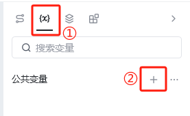

### 1.2 参数介绍

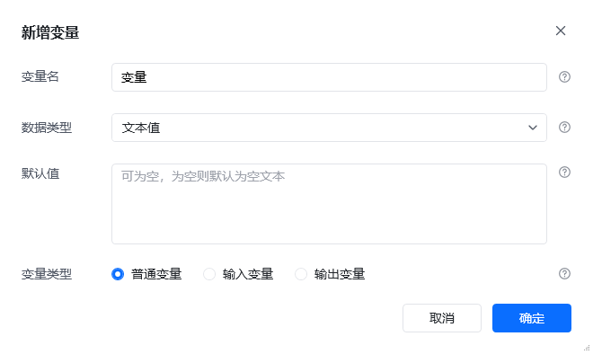

**变量名**

请为变量命名，方便在流程中引用。命名规则：建议简洁、清晰，2-32个字符，如username

- 不能以数字开头
- 不能使用保留名称（If、for等）

**数据类型**

请选择要存储的数据类型

- 文本：存储文字，如“hello”、"张三"
- 数字：存储数值，如100、3.14
- 布尔值：是/否值，如True/False
- 列表：存储多个值，如[“张三”,"李四","王五"]
- 字典：存储键值对，如\{"name":"张三", "age":18\}
- 数据表格：存储数据表格，支持多行多列

**默认值**

- 文本：空文本
- 数字：0
- 布尔值：false
- 日期时间：0001-01-01 00:00:00
- 列表：[]
- 字典：\{\}

**变量类型**

- 普通变量：用于暂存流程中的一般数据，如文本、数字、日期、列表等。这类变量只可以在流程编写是被使用和修改
- 输入变量：运行应用前需要填写的数据，如账号、密码、文件存储路径等。选择此类型后
  - 在启动应用时会提醒用户输入这些数据
  - 在流程中可以像普通变量一样读取和设置变量值
  - 点击“输入/输出变量”后方的预览按钮可设置输入提示、占位符等
- 输出变量：用于在应用运行结束时向外输出数据，类似代码中的 return 值。例如在 Agent 中调用应用后，可通过输出变量把结果返回给 Agent

## 2. 输入变量

### 2.1 作用

选择该类型后，该变量会成为运行应用前需要填写的数据，如账号、密码、文件存储路径等

用户点击“运行”按钮后，即可填写输入参数

|  | 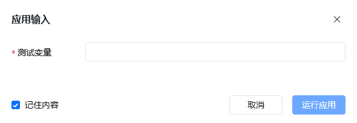 |
| --- | --- |

### 2.2 具体设置步骤

#### （1）在“设置参数”时选择“输入变量”

变量 ---> 公共变量旁边的“+” ---> 新增自定义变量 ---> 变量类型选择“输入变量”

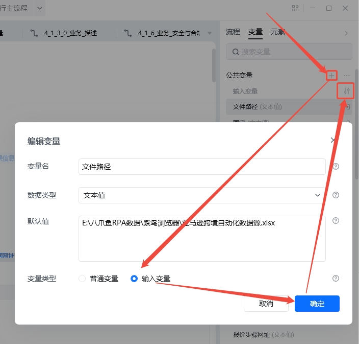

#### （2）“应用输入设置”界面完善“输入变量”信息

点击右侧图标，进入应用输入设置界面，如下：以输入框的设置为例

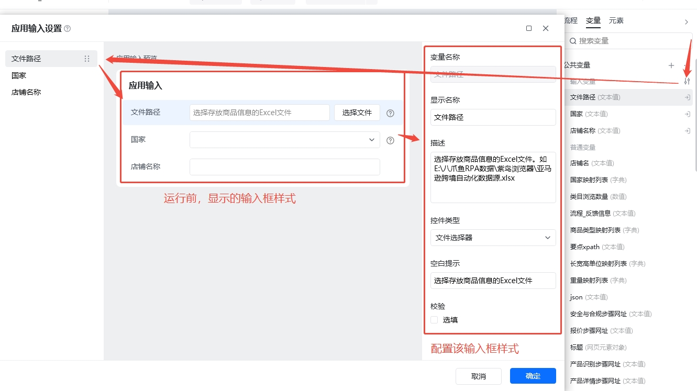

#### （3）数据类型对应的控件类型

| **数据类型** | **控件类型** |
| --- | --- |
| 文本 | 输入框 多行输入框 单选框 文件选择器（如Excel表路径） 文件夹选择器（如下载后文件的存放路径） 密码输入框 时间选择器 日期选择器 |
| 数字 | 数值输入框 |
| 布尔值 | 复选框 开关（v2.4及以上版本支持） |
| 列表 | 多选框 |

<strong>注：</strong>数据类型选择布尔值时，控件可选复选框或开关。开关使用场景：适合直观的开启/关闭逻辑，表示功能状态，不适合复杂描述，如是是否开启AI功能、是否开启调试模式等。复选框使用场景：用于表达选项是否被包含，强调选择而不是状态，如是否保存到本地、是否下载源文件等

#### （4）变量可设置“显示条件”

如果输入参数很多且参数之间有一定关联性，如输入参数A满足xxx情况时，才需要填写参数B和C，可设置“显示条件”

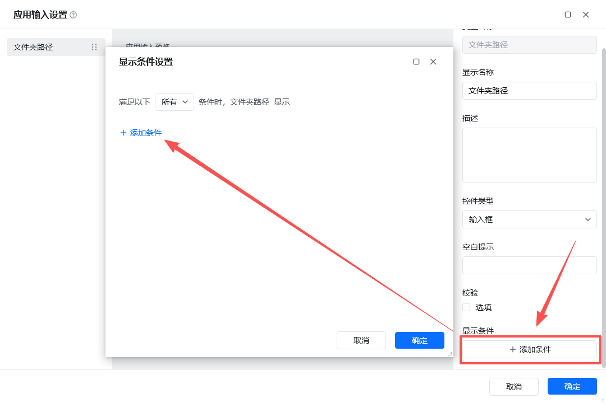

#### （5）支持设置变量默认值

- 使用场景
  - 当应用/指令的参数值90% 情况不变，10% 情况才需要改，就可以设置默认值，如超时时间
  - 业务流程有「行业通用约定」，如金额单位默认为[元]
  - 为了让业务岗的用户能更便捷使用应用，一些可选参数可以设置默认值，让用户只改他们真正关心的部分
  - 作为“示例 / 模板”的一部分，默认值本身也是一种说明方式，告诉用户这个参数“通常填什么”，比文字说明更直观

- 使用方法-应用
  - 在主流程的输入预览界面，设置默认值即可

  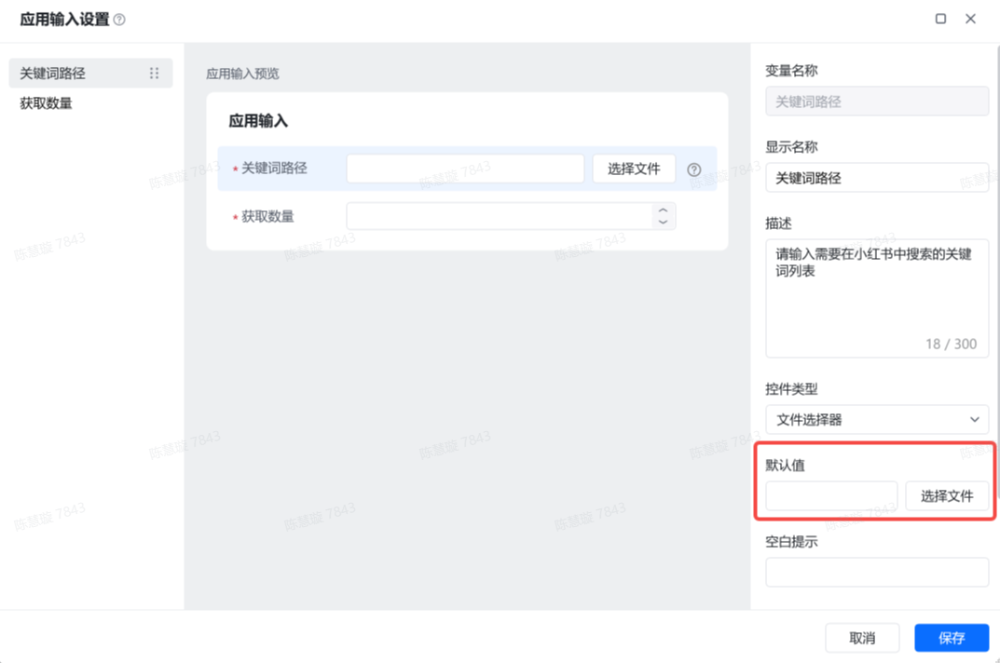

  - 设置完成后，当应用运行时，当前的输入参数就会带默认值

  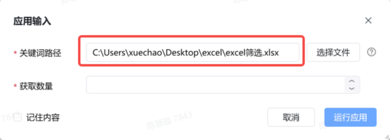

- 使用方法-指令
  - 在指令的输入/输出预览界面直接进行设置

  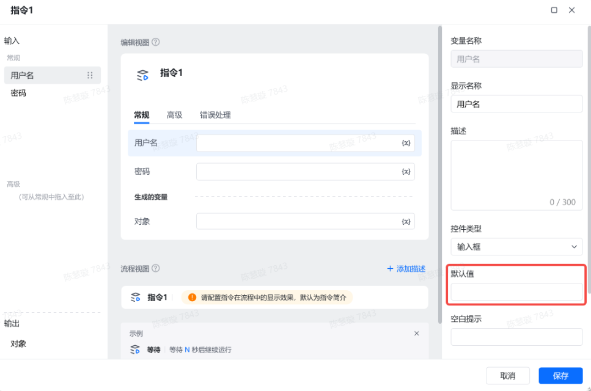

  - 设置完成后，当指令在其他地方使用时，就会带默认值

  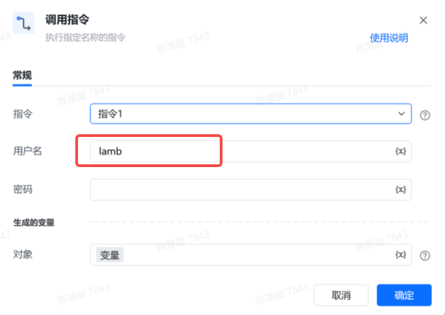

### 2.3 应用输入预览

- 功能背景

很多新用户，设置了“输入变量”，但是在编辑器运行（即调试模式）时，不会出现参数输入界面。①用户容易误以为参数设置没生效；②开发者无法体验用户试用应用全路径，如某参数需要选择文件时，未使用文件选择器控件，手动填写路径非常繁琐等

- 功能说明

如果在应用编辑器内设置了“输入变量”，运行主流程时，就会弹出“应用输入”弹窗

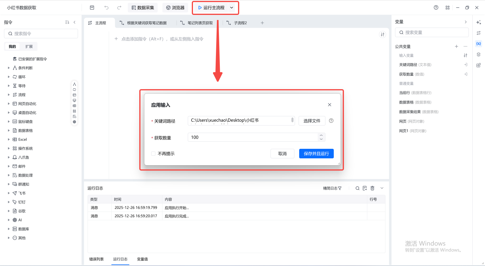

注意：

调试流程时，如果担心每次都有弹窗会影响调试速度，可以选择勾选“不再提示”。后续会自动使用上一次运行的值，不再出现弹窗。当输入输出参数有变化时，弹窗会再次出现

如果需要主动修改输入参数，直接在“运行主流程”下拉列表选择“修改应用输入”，即可出现输入弹窗

### 2.4 记住输入历史

- 功能说明

运行应用时，会主动记住近5次运行此应用时的输入参数，下次运行时可以直接选择历史参数。记住范围包括编辑器运行、应用列表运行、触发器运行

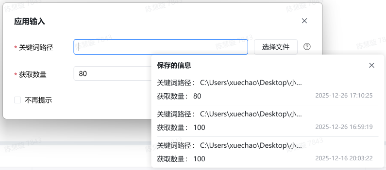

小技巧：由于保存历史空间有限，不方便把所有参数记住的信息都展示出来。大家可以通过鼠标hover预览应用输入表单的每一套参数，确定使用时点击选择即可。

- 使用场景

①如获取淘宝后台数据的RPA应用，输入参数中常有账号、密码，用于控制获取不同账户的后台数据，多套输入参数可以随意切换；

②在应用列表使用一套输入参数运行，运行过程中出现bug时，如果需要在编辑器内调试，需要重新输入一次。有记住历史功能后，直接选择用过的参数即可。

<Info>
  使用过程中遇到问题？前往 [八爪鱼RPA 开发者社区问答板块](https://rpa.bazhuayu.com/community/questions) 提问，获取官方与社区帮助。
</Info>
