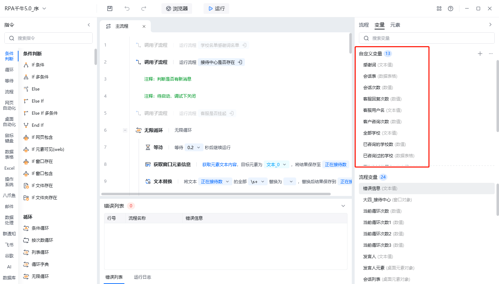
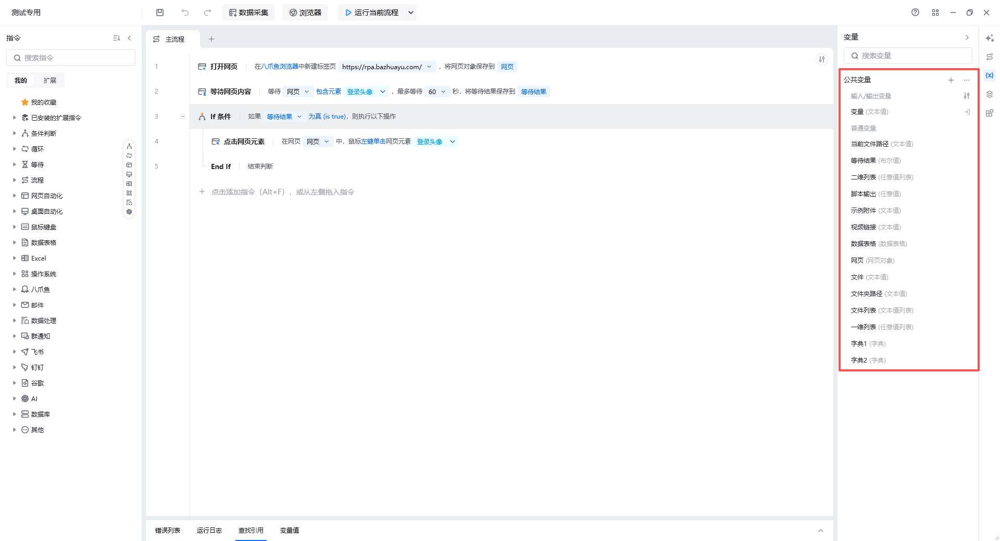
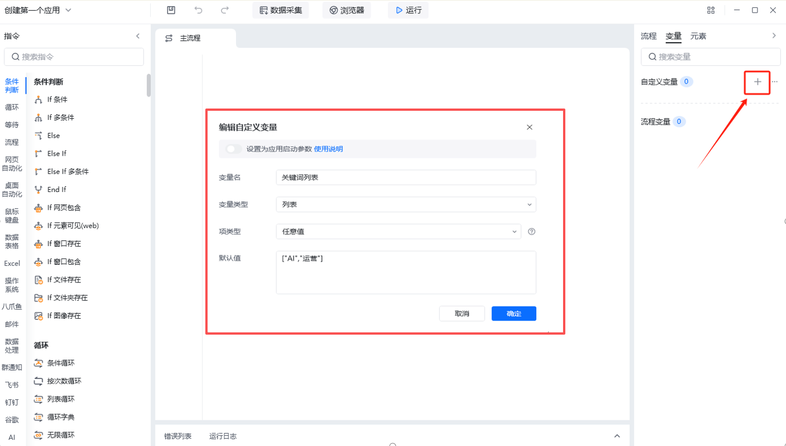
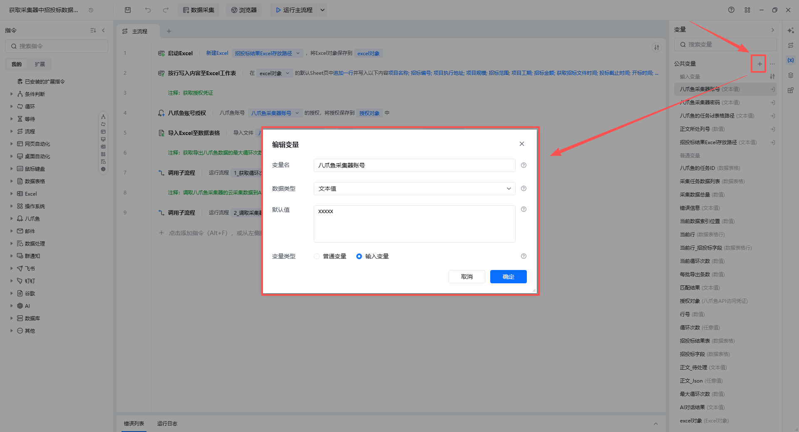
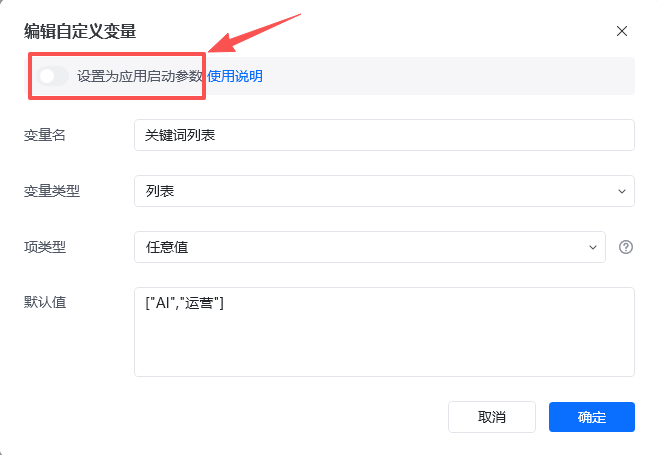
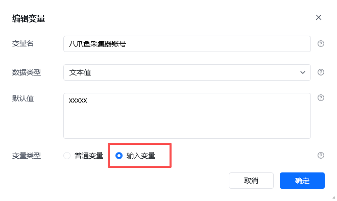
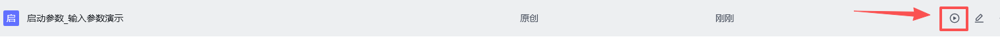
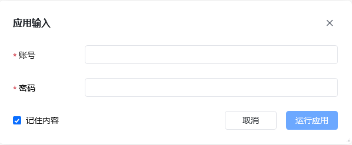
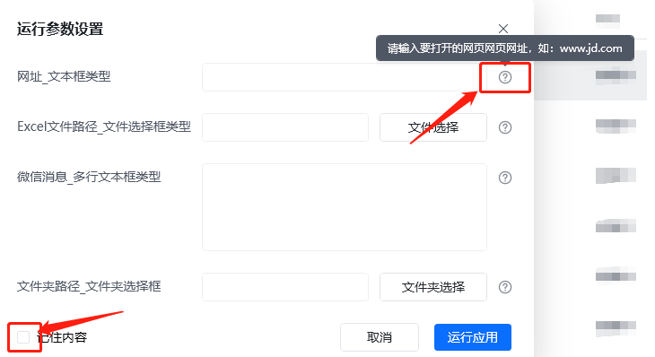
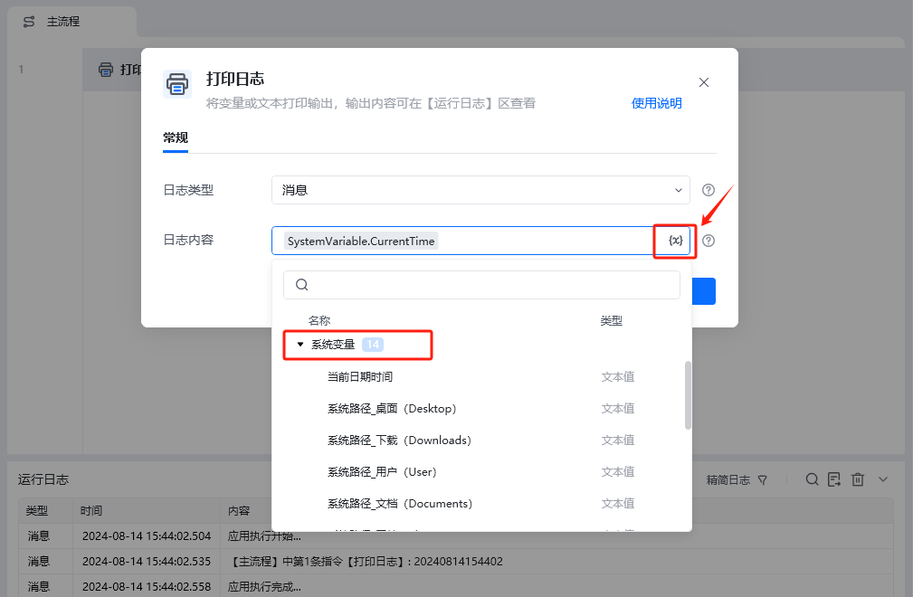

## 1. 什么是变量

和所有程序设计语言一样，八爪鱼 RPA 也有自己的变量，支持类型有文本值、数值、数据表格、列表、日期等，不同类型的变量创建和使用方法略有不同。

我们可以把变量看作是一个房子的门牌号，通过门牌号我们可以找到房子，而通过变量名也可以访问到指定的变量。不同类型的变量，就像房子一样，有工厂、写字楼、超市、学校、住宅等不同作用。

在八爪鱼 RPA 中，我们根据不同的形式，1.x版本将其分成自定义变量和流程变量，2.x版本将其分为输入变量和普通变量。

## 2. 自定义变量

自定义变量是我们手动创建的，在应用运行前设置好某个特定的值。

<table style={{width:'100%', borderCollapse:'collapse'}}>
  <thead>
    <tr>
      <th style={{width:'15%', border:'1px solid #e5e7eb', padding:'12px'}}></th>
      <th style={{width:'42.5%', border:'1px solid #e5e7eb', padding:'12px', textAlign:'center'}}>1.x 版本</th>
      <th style={{width:'42.5%', border:'1px solid #e5e7eb', padding:'12px', textAlign:'center'}}>2.x 版本</th>
    </tr>
  </thead>
  <tbody>
    <tr>
      <td style={{border:'1px solid #e5e7eb', padding:'12px', verticalAlign:'middle', textAlign:'center'}}><strong>自定义变量</strong></td>
      <td style={{border:'1px solid #e5e7eb', padding:'12px', verticalAlign:'middle'}}>
        
      </td>
      <td style={{border:'1px solid #e5e7eb', padding:'12px', verticalAlign:'middle'}}>
        自定义变量又区分输入变量和普通变量。  
        
      </td>
    </tr>
    <tr>
      <td style={{border:'1px solid #e5e7eb', padding:'12px', verticalAlign:'middle', textAlign:'center'}}><strong>新增自定义变量</strong></td>
      <td style={{border:'1px solid #e5e7eb', padding:'12px', verticalAlign:'middle'}}>
        ---&gt;点击+ 号 
        ---&gt;设置变量名称 
        ---&gt;选择变量类型 
        ---&gt;给变量赋默认值（仅在测试模式下生效）  
        
      </td>
      <td style={{border:'1px solid #e5e7eb', padding:'12px', verticalAlign:'middle'}}>
        ---&gt;点击+ 号 
        ---&gt;设置变量名称 
        ---&gt;选择数据类型 
        ---&gt;给变量赋默认值 
        （2.3及以下仅在测试模式下生效； 
        2.4版本会自动带入到正式环境中）  
        
      </td>
    </tr>
  </tbody>
</table>

### 2.1 设置为应用启动参数/输入参数

#### 简介

> 设置后，应用运行时会弹出填写参数值的对话框
> （编辑页面点击运行不会弹出，其他页面如“我的应用/触发器”运行时都会弹出）

| 1.x 版本中打开”设置为应用启动参数“按钮 | 2.x 版本中选择“输入参数” |
| --- | --- |
|  |  |

#### 使用场景

应用启动参数/输入参数可用于需要使用人员填写特定参数的场景。

比如输入账号密码，可以将其设置为应用启动参数/输入参数，这样点击“运行”后就会出现弹窗。有的时候他人分享的应用只开了编辑权限，无法进入测试模式，可通过这种方式给变量赋值。

### 2.2 [2.x 版本的设置方法](https://bazhuayu-rpa-docs.mintlify.site/guides/variables/custom-variable-2x)

### 2.3 [1.x 版本的设置方法](https://bazhuayu-rpa-docs.mintlify.site/guides/variables/custom-variable-1x)

### 2.4 运行参数设置

对于勾选了“设置为应用启动参数”的任务，每次运行时会先出现【运行参数设置】的弹窗。在弹窗内按要求填写参数，然后点击“运行应用”即可。移动鼠标到参数填写框后面的❔上，可以查看该参数填写的详细说明。

<strong>注意：</strong>可以勾选“记住内容”，勾选后下次点击“运行”时，将会将上次填写的参数内容自动填入。

另外也可以通过API接口来修改自定义参数里的值，详细可以参考文档：[API 接口](https://bazhuayu-rpa-docs.mintlify.site/features/enterprise/api)

运行参数设置示例应用：[点击跳转获取示例应用](https://rpa.bazhuayu.com/shareableLink/65b8faabb1c431ffa7dff960)

## 3. 系统变量

系统变量不需要手动创建，其中存储有关系统和应用本身的信息。在支持变量输入的输入框中，点击变量选择按钮，即可找到系统变量分类。

### 3.1 系统变量使用场景

需要以当前日期时间进行文件命名，以前需要多步骤处理，现在可以直接用系统变量中的“当前日期时间”；

需要获取当前电脑的桌面绝对路径；

需要获取应用执行时的一些信息，比如执行器名称、触发器名称等

### 3.2 系统变量分类

当前日期时间：获取当前年月时分秒，暂不支持自定义日期时间格式，仅提供yyyyMMddhhmmss格式。

系统路径_桌面（Desktop）：获取当前应用所在系统的桌面路径

系统路径_下载（Downloads）：获取当前应用所在系统的下载路径

系统路径_用户（User）：获取当前应用所在系统的用户路径

系统路径_文档（Documents）：获取当前应用所在系统的文档路径

系统路径_图片（Pictures）：获取当前应用所在系统的图片路径

系统路径_应用程序数据（Roaming）：获取当前应用所在系统的应用程序数据路径

系统路径_临时文件夹（Temp）：获取当前应用所在系统的临时文件夹路径

系统路径_系统文件夹（Windows）：获取当前应用所在系统的系统文件夹路径

当前应用名称：获取当前运行应用的应用名称

触发器名称：由触发器触发的应用，可获取触发器的名称

触发时间：由触发器触发的应用，可获取触发器的触发时间

执行器名称：由RPA机器人/本地客户端执行的应用，可获取执行器名称

执行用户名：由RPA机器人/本地客户端执行的应用，可获取执行用户名

## 4. 变量类型

各种变量类型，请参考：[内置数据类型](https://rpahelpcenter.bazhuayu.com/helpcenter/docs/37lyht)

<Info>
  使用过程中遇到问题？前往 [八爪鱼RPA 开发者社区问答板块](https://rpa.bazhuayu.com/community/questions) 提问，获取官方与社区帮助。
</Info>
